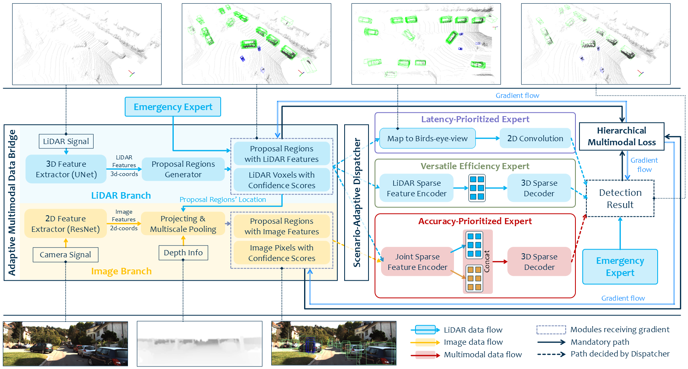

<!-- 1 -->
# EMC2
[](https://opensource.org/licenses/MIT)

The official implementation of paper [Towards Accurate and Efficient 3D Object Detection for Autonomous Driving: A Mixture of Experts Computing System on Edge](https://arxiv.org/abs/2507.04123) [ICCV2025].

Linshen Liu, Boyan Su, Junyue Jiang, Guanlin Wu, Cong Guo, Ceyu Xu, Hao Frank Yang

<!-- 2 abstract  --> 
## Abstract
This paper presents Edge-based Mixture of Experts (MoE) Collaborative Computing (EMC2), an optimal computing system designed for autonomous vehicles (AVs) that simultaneously achieves low-latency and high-accuracy 3D object detection. Unlike conventional approaches, EMC2 incorporates a scenario-aware MoE architecture specifically optimized for edge platforms. By effectively fusing LiDAR and camera data, the system leverages the complementary strengths of sparse 3D point clouds and dense 2D images to generate robust multimodal representations. To enable this, EMC2 employs an adaptive multimodal data bridge that performs multi-scale preprocessing on sensor inputs, followed by a scenario-aware routing mechanism that dynamically dispatches features to dedicated expert models based on object visibility and distance. In addition, EMC2 integrates joint hardware-software optimizations, including hardware resource utilization optimization and computational graph simplification, to ensure efficient and real-time inference on resource-constrained edge devices. Experiments on open-source benchmarks clearly show the EMC2 advancements as a end-to-end system. On the KITTI dataset, it achieves an average accuracy improvement of 3.58% and a 159.06% inference speedup compared to 15 baseline methods on Jetson platforms, with similar performance gains on the nuScenes dataset, highlighting its capability to advance reliable, real-time 3D object detection tasks for AVs. The overall architecture of EMC2 is illustrated in Figure 1.

<!-- 3 here is the figure  -->  
<!-- 
*Figure 1: The architecture of our proposed model framework.* -->
<!-- <p align="center">
  
  <br/>
  <em>Figure 1: System architecture of EMC2. The central row shows the overall data flow, while the top and bottom illustrate key modules. EMC2 consists of five main components: an Adaptive Multimodal Data Bridge (AMDB) for preprocessing multimodal inputs; a Scenario-Adaptive Dispatcher that selects experts based on contextual cues; and three specialized experts—Latency-Prioritized, Versatile Efficiency, and Accuracy-Prioritized—each optimized for different real-time requirements. An Emergency Expert API handles hazardous or unseen cases.</em>
</p> -->

<p align="center">
  
</p>
*Figure 1: System architecture of EMC2. The central row shows the overall data flow, while the top and bottom illustrate key modules. EMC2 consists of five main components: an Adaptive Multimodal Data Bridge (AMDB) for preprocessing multimodal inputs; a Scenario-Adaptive Dispatcher that selects experts based on contextual cues; and three specialized experts—Latency-Prioritized, Versatile Efficiency, and Accuracy-Prioritized—each optimized for different real-time requirements. An Emergency Expert API handles hazardous or unseen cases.*


<!-- 4 here is the installation requirement  -->   
## Requirements
Requirements are provided in ``requirements.txt``.

<!-- 5 here is training and installation code  -->   
## Model Training and Testing
The model is based on Openpcdet framework. Here is the detail process. 

<!-- 5.1 Please Add the (1) installation process, (2)    -->   

## Citation
If you find this useful, please cite the following paper:
```
@article{liu2025EMC2,
  title={Towards Accurate and Efficient 3D Object Detection for Autonomous Driving: A Mixture of Experts Computing System on Edge},
  author={Linshen Liu, Boyan Su, Junyue Jiang, Guanlin Wu, Cong Guo, Ceyu Xu, Hao Frank Yang},
  journal={arXiv preprint arXiv:2507.04123},
  year={2025}
}
```